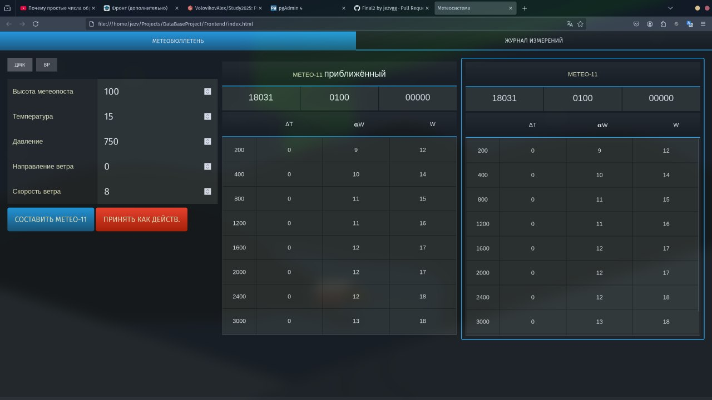
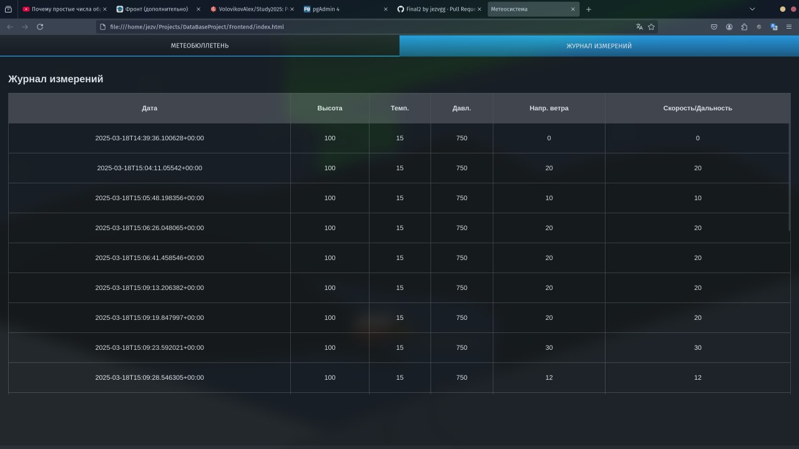

# Meteo

Проект по автоматизации расчетов метрологической подготовки при выполнении стрельб из ствольной артиллерии. Основа проекты выполнена на базе PostgreSQL, Docker, Html, JavaScript. Особенности данного проекта является использованием расширения [PostgRest](https://docs.postgrest.org/en/v12/index.html) для реализации RestApi. Алгоритмы согласно [технического задания](./Docs/TechnicalTask.md) реализованы на базе PostgreSQL (функции / процедуры и триггеры). Запуск решения осуществляется с помощью отдельных команд на основе Docker образов. Реализация данного проекта является завершением обсучения по курсу Основные разработки системы на основе PostgreSQL в [ИГУ](http://isu.ru)




## Структура
```
.
├── Database # Скрипты для создания БД
│   ├── create_calculations.sql # 4. Реализация рассчётных функций и процедур
│   ├── drop_structure.sql # 1. Удаления старой структуры, если таковая имеется
│   ├── insertion_values.sql # 3. Вставка значений для поправок
│   ├── mock_script.sql # Скрипт создающий тестовых пользователей и записи к ним
│   └── tables_stucture.sql # 2. Создание структуры и таблиц
├── Docs # Техническое задание по проекту
│   ├── AlgoritmBp.md
│   ├── AlgoritmDmk.md
│   ├── _Images
│   └── TechnicalTask.md
├── Frontend # Интерфейс планшета
│   ├── index.html
│   ├── main.css
│   └── main.scss
├── docker-compose.yaml
├── Makefile
└── README.md
```

## Инструкции по сборке

В проекте прописан файл для его сборки, а также docker-compose.
Поэтому если у вас установлен docker и docker-compose, то достаточно написать команду:
```
make start
```

Когда вы захотите остановить систему, то используйте:
```
make stop
```

Если вам нужен один скрипт, создающий базу данных, для вставки в свою базу, то можно использовать:
```
make build
```

